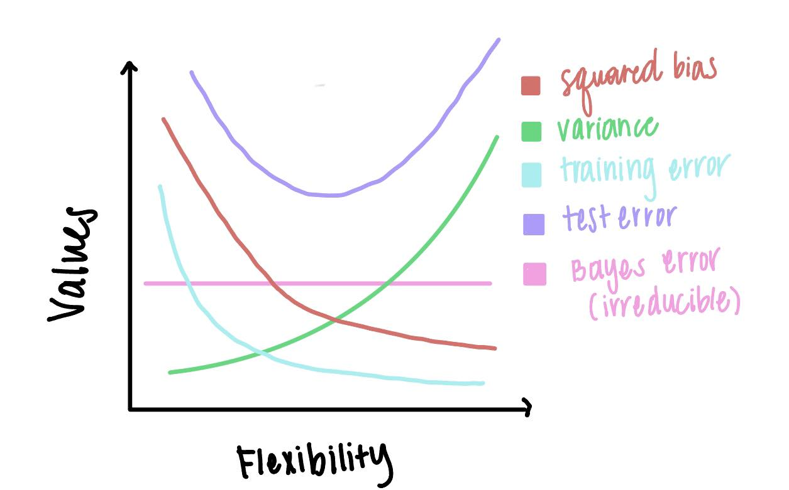

## Filling gaps in lecture notes (10pts)

Consider the regression model
$$
Y = f(X) + \epsilon,
$$
where $\operatorname{E}(\epsilon) = 0$. 

### Optimal regression function

Show that the choice
$$
f_{\text{opt}}(X) = \operatorname{E}(Y | X)
$$
minimizes the mean squared prediction error
$$
\operatorname{E}\{[Y - f(X)]^2\},
$$
where the expectations averages over variations in both $X$ and $Y$. (Hint: condition on $X$.)

#### Optimal Regression Function Answer

$$
\begin{align*}
& \operatorname{E}\{[Y - f(X)]^2\} = 
\operatorname{E}\{\underbrace{(Y- \operatorname{E}(Y | X)}_\text{a} + \underbrace{\operatorname{E}(Y | X) - f(X)}_\text{b})^2\} \\
& \text{Recall } (a+b)^2 = a^2 + 2ab + b^2 \\
&= \operatorname{E}[(Y-\operatorname{E}(Y | X))^2] 
+ 2\underbrace{\operatorname{E}[(Y-\operatorname{E}(Y | X))] \operatorname{E}[(\operatorname{E}(Y | X)- f(X))}_\text{zero in on this below}
+ \operatorname{E}[(\operatorname{E}(Y | X)- f(X))^2] 
\\
\text{by the law of iterated expectations } \operatorname{E}[X]&= \operatorname{E}[\operatorname{E}[Y | X] \\
&= \operatorname{E}[\operatorname{E}[Y-\operatorname{E}(Y | X)] [\operatorname{E}(Y | X) - f(X) | X] \\
&= \operatorname{E}[\underbrace{(\operatorname{E}[(Y|X)-\operatorname{E}(Y | X))}_\text{0} (\operatorname{E}(Y | X) - f(X))] \\
&= 0 \\

\\
\operatorname{E}\{[Y - f(X)]^2\} &= \underbrace{\operatorname{E}([Y - \operatorname{E}[(Y|X)]^2)}_\text{greater or equal to 0} + \underbrace{\operatorname{E}[\operatorname{E}(Y|X) - f(X)]^2}_\text{greater or equal to 0} \\
\operatorname{E}(Y | X) - f(X) &= 0 \\
f(x) &= \operatorname{E}(Y | X) \\
& \text{Recall } \underbrace{(a-b)^2}_\text{greater or equal to 0} +  \underbrace{(c-d)^2}_\text{minimized when c = d} = 0 \\

& \text{Thus, } 

f_{\text{opt}}(X) = \operatorname{E}(Y | X) \text{ minimizes } \operatorname{E}\{[Y - f(X)]^2\}.  \\

\end{align*}
$$

### Bias-variance trade-off

Given an estimate $\hat f$ of $f$, show that the test error at a $x_0$ can be decomposed as
$$
\operatorname{E}\{[y_0 - \hat f(x_0)]^2\} = \underbrace{\operatorname{Var}(\hat f(x_0)) + [\operatorname{Bias}(\hat f(x_0))]^2}_{\text{MSE of } \hat f(x_0) \text{ for estimating } f(x_0)} + \underbrace{\operatorname{Var}(\epsilon)}_{\text{irreducible}},
$$
where the expectation averages over the variability in $y_0$ and $\hat f$.

#### Bias-Variance Trade-off Answer 

$$
\text{Given that} \:
Y = f(X) + \epsilon \
\text{and} \
\operatorname{E}(\epsilon) = 0 
\text{,}
\\ \text{we can decompose the expected mean squared test error at } X_{0} 
\text{ into irreducible (1) and reducible error (2). }
\\
$$
$$
\begin{align*}

\operatorname{E}\{[y_0 - \hat f(x_0)]^2\} 
&= \operatorname{E}\{[y_0 - f(x_0) + f(x_0) - \hat f(x_0)]^2\}

\\ &= \operatorname{E}\{[y_0 - f(x_0)]^2\} +
\operatorname{E}\{[ f(x_0) - \hat f(x_0)]^2\} -
2\operatorname{E}\{[(f(x_0) - \hat f(x_0))(y_0 -  f(x_0))]\} \\

& \text{Recall } (a-b)^2 = a^2 - 2ab + b^2 \\
a^2 &= \operatorname{E}\{[y_0 - f(x_0)]^2\} \\
b^2 &= \operatorname{E}\{[ f(x_0) - \hat f(x_0)]^2\} \\
2ab &= 2\operatorname{E}\{[(f(x_0) - \hat f(x_0))(y_0 -  f(x_0))]\} \\
&= 2\operatorname{E}\{[f(x_0)(y_0)-f(x_0)^2- \hat f(x_0)(y_0) + f(x_0) \hat f(x_0)]\}\\
&= 2(f(x_0)^2-f(x_0)^2-f(x_0)\operatorname{E}\{[\hat f(x_0)]\}+f(x_0)\operatorname{E}\{[\hat f(x_0)]\}) \\
&= 2(0) \\
&=0 \\


\\ &= \operatorname{E}\{[y_0 - f(x_0)]^2\} +
\operatorname{E}\{[ f(x_0) - \hat f(x_0)]^2\} \\

& \text{For simplicity and clarity, I will break these terms up to solve individually and combine them in the end.}
\end{align*}
$$
$$
\begin{align*}
& \text{(1) reducible error} \\
\operatorname{E}\{[y_0 - \hat f(x_0)]^2\} &= 
\operatorname{E}\{[\hat f(x_0) + \epsilon - \hat f(x_0)]^2\} \text{ sub in } \hat f(x_0) + \epsilon \text{ for } y_0 \\
&= \operatorname{E}(\epsilon^2) -  \operatorname{E}(\epsilon)^2 + \operatorname{E}(\epsilon)^2 \\ &= E[\epsilon^2] - E[\epsilon]^2 + 0 \\
&= \operatorname{Var}(\epsilon)
\end{align*}
$$
$$
\begin{align*}
& \text{(2) irreducible error} \\

\operatorname{E}\{[ f(x_0) - \hat f(x_0)]^2\}
&= \operatorname{E}\{[f(x_0) + {E}[\hat f(x_0)] - {E}[\hat f(x_0) ] - \hat f(x_0)]^2]\} \\
&= \operatorname{E}\{[f(x_0) + {E}[\hat f(x_0)]]^2\} 
- 2\operatorname{E}\{[ (f(x_0) + E[\hat f(x_0)]) * (E[\hat f(x_0) ] - \hat f(x_0)])]\}
+ \operatorname{E}\{[\hat f(x_0) + {E}[\hat f(x_0)]^2]\} \\

& \text{Recall } (a-b)^2 = a^2 - 2ab + b^2 \text{, we will zero in on the latter part b in 2ab}. \\
& 2\operatorname{E}\{[ (f(x_0) + E[\hat f(x_0)]) * (E[\hat f(x_0) ] - \hat f(x_0)])]\} \\
& \operatorname{E}\{[\hat f(x_0) - {E}\{[(\hat f(x_0))]\} \\
&= E[\hat f(x_0)] - E[\hat f(x_0)] \text{    because the expected value of an expected value is just itself} \\
&= 0 \\

& \text{Thus, we are left with } \\

&= \operatorname{E}\{[f(x_0) + {E}[\hat f(x_0)]]^2\} 
+ \operatorname{E}\{[\hat f(x_0) + {E}[\hat f(x_0)]^2]\} \\
&= \operatorname{Var}(\hat f(x_0))  + [\operatorname{Bias}(\hat f(x_0))]^2
\end{align*}
$$
$$
\begin{align*}
& \text{Combining (1) reducible error and (2) irreducible error we get a bias-variance decomposition of} \\
&= \operatorname{Var}(\hat f(x_0)) + [\operatorname{Bias}(\hat f(x_0))]^2 + \operatorname{Var}(\epsilon)

\end{align*}
$$

## ISL Exercise 2.4.3 (10pts)


```{r, eval = F}
#Ignore this code chunk
library(tidyverse)
#fit <- lm(sales ~ TV, data = )
```

We now revisit the bias-variance decomposition.

#### 2.4.3 a: Sketch of (Squared) Bias, Variance, Training Error, Test Error, and Bayes Error Curves

(a) Provide a sketch of typical (squared) bias, variance, training error, test error, and Bayes (or irreducible) error curves, on a single plot, as we go from less flexible statistical learning methods towards more flexible approaches. The x-axis should represent the amount of flexibility in the method, and the y-axis should represent the values for each curve. There should be five curves. Make sure to label each one.




In case the image path doesn't work, I provided a link here:
[Sketch](https://photos.app.goo.gl/yHRFD3UVGRxSsdCN9)

#### 2.4.3 b: Explanation of the Shape of the Curves

(b) Explain why each of the five curves has the shape displayed in part (a).

Bias: As flexibility increases, bias decreases because the model can better fit the data and the predicted value is closer to the actual value. In general, the more flexible the model, the lower the bias (pg.35 in ISLR textbook). This is because the model can better fit the data and will closely match the training set. Notice that at the point the bias is at its lowest, the variance is at its highest, and visa versa (hence Bias-Variance Tradeoff).

Variance: As flexibility increases, variance increases because the model is more sensitive to fluctuations in the training set. In general, more flexible statistical methods have higher variance (pg.35 in ISLR textbook). This is because the model is more likely to overfit the data and will not generalize well to new data. A model with no flexibility would not be able to capture the variability in the data, resulting in zero variance.

Training Error: As flexibility increases, the training error decreases. The model can better capture the underlying patterns in the training set. Thus, the training error will be lower for more flexible models because they can better fit the training data, leading to predicted values that are closer to the true values. However, even if the training error is low, this only indicates improved performance on the training data and the model may not generalize well to new data, this is why we look at test error.

Test Error: The shape of the test error is a concave curve that initially decreases as flexibility increases, but then increases after a certain point. This is because the error goes down as it becomes a closer fit, but then goes up as the model starts to overfit the data (it will not generalize well to unseen data). The test error is excessively high in the beginning where flexibility is low because the model is too simple and cannot capture the underlying patterns in the data. The test error is the lowest at the point where the bias and variance are balanced, which is the optimal level of flexibility for the model. This is the point where the model has the lowest test error and is the best fit for the data.

Bayes Error/Irreducible Error: The Bayes Error is constant and does not change with the flexibility of the model. It is the lowest possible test error rate (pg.38` in ISLR textbook) that can be achieved and is the error that would be achieved by a perfect model. The Bayes Error is the lowest point on the graph and is the point that the test error is trying to reach. When the training error goes below the Bayes Error, it suggests that overfitting is occurring.

## ISL Exercise 2.4.4 (10pts)

#### 2.4.4 a: Real-Life Applications of Classification

(a)Describe three real-life applications in which classification might be useful. Describe the response, as well as the predictors. Is the goal of each application inference or prediction? Explain your answer.

1. Medicare Fraud Detection: This was a research project I actually worked on during undergrad, where I used large CMS Medicare datasets to detect fraudulent providers. Response: The providers were classified as fraudulent or not fraudulent. Predictors: Features included the type of procedure/service they provided using HCPCS codes, the total Medicare reimbursement, and the ratio of the HCPCS to the number of Medicare beneficiaries. Goal: The objective of this project is prediction, as our ensemble model was used to predict whether a provider is fraudulent or not based on the features.

2. Agricultural Planning/Soil Classification: Classification can be used to classify soil types based on their physical and chemical properties to optimize agricultural practices. Response: The response variable would represent the soil type (sand, loam, clay, silt, etc). Predictors: The predictors would include attributes about the soil such as the pH level, the amount of nitrogen, phosphorus, and potassium, the soil texture, and the soil color. Goal: The goal of this application is inference, as this information would be important for agricultural planning and land use management. This will allow farmers to know which soil is more fertile and where to plant crops so that they thrive best in their ideal soil types. 

3. Image Classification (ex. Classify Images of Animals). Image classification refers to the task of assigning a label to an image from a fixed set of categories, and can be used for applications such as medical imaging, facial recognition, and object detection. In this case I will use animal image classification as my example. Response: The response variable would represent the label of the image, such as "cat", "dog", "bird', "wild animals", etc. Predictors: The predictors would include the pixel values of the image, the color, the texture, and the shape. Goal: The goal of this application is prediction, as the model would be used to predict the label of the image based on the predictors. Animal image classification can play an important role in wildlife conservation, as it can be used to monitor and track the population of endangered species and analyze their behavior.

#### 2.4.4 a: Real-Life Applications of Regression

(b) Describe three real-life applications in which regression might be useful. Describe the response, as well as the predictors. Is the goal of each application inference or prediction? Explain your answer.

1. Netflix Popularity/User Engagement: This was a project that I worked on and presented at a data science symposium, in which I used regression to predict the popularity of Netflix shows. Response: The response variable would represent the popularity of the Netflix show, which was measured by the number of views, ratings, and comments. Predictors: The predictors included the genre, marketing budget, the cast, the director, and the duration. Goal: The goal of this application was mainly prediction but it could also be inference. The model was used to forecast the popularity of a Netflix show based on the predictors, but this could also be used to draw insights on viewer experience and inform recommendations on Netflix.

2. Health Outcomes: Regression can be used to predict health outcomes, such as high blood pressure. Response: The response variable would represent the likelihood of a patient getting high blood pressure. Predictors: The predictors could include diet, age, weight or BMI, exercise habits, and genetic history. Goal: The goal of this application is prediction, as the model would be used to predict the likelihood of a patient getting high blood pressure based on the predictors.

3. Salary Prediction: Regression can be applied to predict salary. Response: The response variable would represent the annual income of an individual. Predictors: The predictors could include education level, years of experience, position within the company/organization, location, and industry. Goal: The goal of this application is prediction, as the model would be used to predict the salary of an individual based on the predictors.

#### 2.4.4 a: Real-Life Applications of Cluster Analysis
(c) Describe three real-life applications in which cluster analysis might be useful.

1. TED Talk Sentiment Analysis and Clustering: This was a project I worked on before, where I analyzed real TED Talk transcripts and used K-means clustering to group the TED Talks based on their sentiment scores and topics. Response: Sentiment were determined by the sentiment of the TED Talk, whether it is positive, negative, or neutral. Topic clusters were created based on themes that appeared (ex. women empowerment, disease, music, etc) Predictors: Several of the predictors included the text of the TED Talk transcripts, the number of views, the number of comments, and the speaker's occupation. Goal: The goal of this application is inference, as I aimed to draw insights and underlying themes from the TED Talks to identify popular topics and better understand audience engagement/preferences.

2. Customer Segmentation: Cluster analysis can be used to segment customers based on their purchasing behavior. Response: The response variable would represent the customer segment, as the model seeks to identify groups of customers with similar purchasing behavior. Predictors: The predictors could include the frequency of purchases, the amount spent, the type of products purchased, and the location. Goal: The goal of this application is prediction, as the model would be used to predict the customer segment that each customer belongs to based on the predictors listed. However, one could argue that the goal could also be inference as the model could be used to draw marketing insights on customer preferences and purchasing patterns.

3. City Planning / Urban Design: Cluster analysis can be used to group neighborhoods based on their characteristics for urban planning. Response: The response variable would represent the neighborhood cluster, as the model seeks to identify groups of neighborhoods with similar characteristics. Predictors: Predictors could entail population density, income levels, age, household size, education level, transportation patterns, and crime rate. Goal: The goal of this application is inference, as the model help city planners make informed decisions in allocating resources, devise a plan for affordable housing, and foster sustainable urban development.

## ISL Exercise 2.4.10 (30pts)

Your can read in the `boston` data set directly from url <https://raw.githubusercontent.com/ucla-biostat-212a/2024winter/master/slides/data/Boston.csv>. A documentation of the `boston` data set is [here](https://www.rdocumentation.org/packages/ISLR2/versions/1.3-2/topics/Boston).

::: {.panel-tabset}

#### R

```{r, evalue = F}
library(tidyverse)

Boston <- read_csv("https://raw.githubusercontent.com/ucla-biostat-212a/2024winter/master/slides/data/Boston.csv", col_select = -1) %>% 
  print(width = Inf)
```


```{r part a load dataset}
# install.packages("ISLR2")
library(ISLR2)
library(GGally)
Boston
?Boston
dim(Boston)
```

##### a. Boston Dataset Dimensions
There are 506 rows and 13 columns in the Boston data set. The rows represent the 506 suburbs in Boston and their housing values. Each row corresponds to one suburb in Boston and the predictor variables for that suburb. Each column represents a different predictor variable for the housing values (Ex. crim= per capita crime rate by town, zn = proportion of residential land zoned for lots over 25,000 sq.ft, etc).

More information about the Boston data set can be found from this source: https://rdrr.io/cran/ISLR2/man/Boston.html

##### b. Pairwise Scatterplots
```{r part b scatterplots, evalue = T, message = FALSE}
Boston %>% ggpairs(progress = FALSE,  #hide progress output
                   lower = list(continuous = wrap("points", alpha = 0.3, size=0.5)), diag=list(continuous='barDiag'),
                   upper = list(continuous = wrap("cor", size = 2))) + theme(axis.text = element_text(size = 5), #change axis label sizes to stop overlapping 
      strip.text.x = element_text(size = 5), #change row text label sizes
      strip.text.y = element_text(size = 5)) #change col text label sizes
```


Findings: Some of the variables appear to be correlated. For example, tax (full-value property-tax rate per $10,000) and rad (index of accessibility to radial highways) have a strong positive correlation coefficient of 0.91. Indus (proportion of non-retail business acres per town) and nox (nitrogen oxides concentration (parts per 10 million)) also have a high correlation coefficient of 0.764, which suggests that the increasing presence of non-retail businesses may correspond to increases in the nitrogen oxides concentration levels. Lstat (lower status of the population (percent)) and medv (median value of owner-occupied homes in 1000s of dollars) have a negative correlation of -0.738, which is reasonable since more people with lower status would be expected to have lower median values in homes.

The diagonal bar graphs show that few of the variables have a normal distribtution, such as rm(average number of rooms per dwellin) and medv(median value of owner-occupied homes in $1000s). Variables like age (proportion of owner-occupied units built prior to 1940) are skewed to the left, which implies that most of the units are old and built before 1940 and there are very few cases of units built after 1940. Other variables dis (weighted mean of distances to five Boston employment centres) and lstat (lower status of the population (percent)) are skewed to the right. We can interpret this skewedness as most units are in the lower status of the population and most units have a short average distance to nearby employment centers in Boston.

##### c.Association of Predictors with Per Capita Crime Rate
There does appear to be an association between per capita crime rate and some of the predictor variables, though the variables with the highest association are considered moderately correlated (between 0.5 and 0.7). Most of the predictor variables are weakly correlated (<abs(0.4)) with per capita crime rate.

| rad&crime = 0.626 The higher the index of accessibility to radial highways, the higher per capita crime rate by town.
| tax&crime = 0.583 The higher the full-value property-tax rate per $10,000, the higher per capita crime rate by town.
| lstat&crime = 0.456 More crime happens for those in lower status of the population.
| medv&crime = -3.888 The higher the median value of owner-occupied homes, the less crime that occurs.


##### d. Census Tracts and Per Capita Crime Rate
Do the census tracts of Boston appear to have particularly high crime rates? Tax rates? Pupil-teacher ratios? Comment on the range of each predictor.
```{r}
hist(Boston$crim, main = "Distribution of Crime Rates in Boston Suburbs", xlab = "Crime Rate per Capita by Town", col = "lightblue")
summary(Boston$crim)
sd(Boston$crim)
sum(Boston$crim < 10)/length(Boston$crim)
sum(Boston$crim > 40)/length(Boston$crim)

```
Among the population of Boston suburbs, the per capita crime rate ranges from 0.00632 to 88.9762, the mean crime rate is about 3.16352 per capita, the median crime rate is 0.25651 per capita, and the standard deviation is 8.601545. The standard deviation of 8.601545 suggests that the data points are spread out from the mean. The histogram shows that the distribution of crime rates among Boston suburbs is right-skewed, with the frequency of crime rates peaking between 0-10. While there are some census tracts with particularly high crime rates (1%), the large majority (89%) of the census tracts have low crime rates. The maximum 88.97 is about 9.92 standard deviations away from the mean ( (88.97-3.61352)/8.601545 = 9.923389) and the minimum 0.00632 is only about 0.4193665 standard deviations away from the mean. (abs(0.00632-3.61352)/8.601545 = 0.4193665) This indicates that 88.97 is an outlier and further supports that the data is right-skewed.

```{r}
hist(Boston$tax, main = "Distribution of Property Tax Rates in Boston Suburbs", xlab = " Property Tax Rates (per $10,000)", col = "lightblue")
summary(Boston$tax)
sd(Boston$tax)
sum(Boston$tax <= 400)/length(Boston$crim)
sum(Boston$tax >= 650)/length(Boston$crim)
sum(Boston$tax > 400 & Boston$tax < 650)/length(Boston$crim)
```
Among the population of Boston suburbs, the tax rate (per 10000 dollars) ranges from 187 to 711 dollars, with a median of 330 dollars, mean of 408.2 dollars, and standard deviation of 168.5371. Since the mean is greater than the median, the distribution of property tax rates is right-skewed, and shows that 60.5% of the data points fall below 400 dollars. About 27% of the census tracts have high tax rates over 650 dollars, which is about 1.43 standard deviations above the mean ((650 - 408.2)/ 168.5371 = 1.434699). This is also demonstrated by the histogram and the Upper Quartile being 666 dollars. However, there is a big gap in property taxes between 400 and 650 (only 12.5% fall within this range), suggesting that there is a wealth disparity in the Boston suburbs.


```{r}
hist(as.numeric(Boston$ptratio), main = "Distribution of Pupil-Teacher Ratio in Boston Suburbs", xlab = "Pupil-Teacher Ratio", col = "lightblue")
summary(as.numeric(Boston$ptratio))
sd(as.numeric(Boston$ptratio))
sum(Boston$ptratio < 20)/length(Boston$crim)
sum(Boston$ptratio >= 20)/length(Boston$crim)
```

Among the population of Boston suburbs, the pupil-teacher ratio ranges from 12.6 to 22, with a median of 19.05, mean of 18.46 and standard deviation of 2.164946. The mean is less than the median, so the distribution is left-skewed. 39.7% of the census tracts have relatively high pupil-teacher ratios above 20, which is also depicted in the histogram as the frequency peaks between 20-21. This is about ((20-18.46) / 2.164946) = 0.71 standard deviations above the mean. This reveals disparities in class sizes and the quality of education across the different census tracts as nearly 40% of the census tracts have high pupil-teacher ratios above 20, so there is more overcrowded classrooms and less individual attention for students. 60.3% of the census tracts have low pupil-teacher ratios below 20 and are more scattered across a wider range of values between 12.6 to 20. This suggests that there is more variability in pupil-teacher ratios, class sizes, and education resources across these suburbs.

```{r}
##### e. Census Tracts and Charles River
```{r}
sum(Boston$chas == 1)
```
35 of the census tracts bound the Charles river.

##### f. Median Value of Owner-Occupied Homes and Census Tracts
```{r}
median(Boston$ptratio)
```
The median pupil-teacher ratio among the towns is 19.05.

##### g. Cennsus Tracts with Low Median Value of Homes
(g) Which census tract of Boston has lowest median value of owner- occupied homes? What are the values of the other predictors for that census tract, and how do those values compare to the overall ranges for those predictors? Comment on your findings.

```{r}
#Find suburb numbers with lowest median value of owner-occupied homes
which(Boston$medv == min(Boston$medv))

#Find the values of the other predictors for that census tract
Boston %>% filter(medv == min(medv)) 

summary(Boston$zn)
summary(Boston$indus)
summary(Boston$chas)
summary(Boston$nox)
summary(Boston$rm)
summary(Boston$age)
summary(Boston$dis)
summary(Boston$rad)
summary(Boston$tax)
summary(Boston$lstat)

sd((Boston$indus))
sd((Boston$rad))
sd((Boston$tax))
sd((Boston$age))
sd((Boston$lstat))

```
There are two census tracts with the lowest median value of 5: 399 and 406. The values of the other predictors for that census tract are outputted in the table above, with the first row representing census tract 399 and the second row corresponding to census tract 406.

The values of the other predictors for census tract 399 are: crim = 38.3518, zn = 0, indus = 18.1, chas = 0, nox = 0.693, rm = 5.453, age = 100, dis = 1.4896, rad = 24, tax = 666, ptratio = 20.2, and lstat = 30.59. 

The values of the other predictors for census tract 406 are: crim = 67.9208, zn = 0, indus = 18.1, chas = 0, nox = 0.693, rm = 5.683, age = 100, dis = 1.4254, rad = 24, tax = 666, ptratio = 20.2, and lstat = 22.98. 

Several of the other predictors for both census tracts have values at the upper end of the range or are the maximum values for the predictors, such as the proportion of non-retail business acres per town (indus), the index of accessibility to radial highways (rad), the full-value property-tax rate per $10,000 (tax), and the percentage of owner-occupied units built prior to 1940 (age). 

These two census tracts share some of the same values for the predictors, these are a few key takeaways for both census tracts:

- The proportion of non-retail business acres per town (indus) is 18.1, which is
- The index of accessibility to radial highways (rad) is 24, 
- The full-value property-tax rate per $10,000 (tax) is 666,  
- The percentage of owner-occupied units built prior to 1940 (age) is 100. 

Other main takeaways are that the percentages of the lower status of the population (lstat) is 30.59 for census tract 399 and 20.34 for census tract 406, which is 2.61 and 1.08 standard deviations above the mean, respectively. Two of the predictors, zn and chas, have the lowest possible value of 0 for both census tracts.

Scratchwork - How I Calculated SD:

(18.1-11.14)/6.860353 = 1.01 standard deviations above the mean for indus
(24-9.549)/8.707259 = 1.66 standard deviations above the mean for rad
(666-408.2)/168.5371 = 1.53 standard deviations above the mean for tax
(100-68.57)/28.14886 = 1.12 standard deviations above the mean for age
(30.59-12.65)/7.141062 = 2.61 standard deviations above the mean for census tract 399  
(20.34-12.65)/7.141062 = 1.08 standard deviations above the mean for census tract 406.


##### h. Cennsus Tracts and Rooms per Dwelling
 In this data set, how many of the census tracts average more than seven rooms per dwelling? More than eight rooms per dwelling? Comment on the census tracts that average more than eight rooms per dwelling.

```{r}
sum(Boston$rm > 7)
sum(Boston$rm > 7)/length(Boston$rm)

sum(Boston$rm > 8)
sum(Boston$rm > 8)/length(Boston$rm)


more_than_eight = Boston %>% filter (Boston$rm > 8)
more_than_eight
summary(more_than_eight)

hist(more_than_eight$medv, main = "Distribution of Median Value of Owner-Occupied Homes \n in Boston Suburbs with More than 8 Rooms per Dwelling", xlab = "Median Value of Owner-Occupied Homes in $1000s", col = "lightblue")

hist(more_than_eight$zn, main = "Distribution of Proportion of Residential Land Zoned for Lots Over 25,000 sq.ft \n in Boston Suburbs with More than 8 Rooms per Dwelling", xlab = "Proportion of Residential Land Zoned for Lots Over 25,000 sq.ft", col = "lightblue")

hist(more_than_eight$lstat, main = "Distribution of Lower Status of the Population \n in Boston Suburbs with More than 8 Rooms per Dwelling", xlab = "Lower Status of the Population (percent)", col = "lightblue")


hist(more_than_eight$rad, main = "Distribution of Index of Accessibility to Radial Highways \n in Boston Suburbs with More than 8 Rooms per Dwelling", xlab = "Index of Accessibility to Radial Highways", col = "lightblue")

hist(more_than_eight$age, main = "Distribution of Proportion of Owner-Occupied Units Built Prior to 1940 \n in Boston Suburbs with More than 8 Rooms per Dwelling", xlab = "Proportion of Owner-Occupied Units Built Prior to 1940", col = "lightblue")


```
The number of census tracts that average more than seven rooms per dwelling is 64. This is about 12.65% of the census tracts in Boston.

The number of census tracts that average more than eight rooms per dwelling is 13. This is about 2.57% of the census tracts in Boston.

A key takeaway is that the census tracts that average more than eight rooms per dwelling is an extremely small fraction, only 2.57%, and these tracts most likely represent the wealthiest areas. The census tracts that average more than eight rooms per dwelling are likely to have high median values (mostly 35-50 in 1000s) of owner-occupied homes (medv), low proportion (mostly 0%-20%) of residential land zoned for lots over 25,000 sq.ft (zn), and extremely low percentages (only 2-8%) of the lower status of the population (lstat). They are also likely to have a low index (mostly 0-10) of accessibility to radial highways (rad) and high percentages (60-100%) of owner-occupied units built prior to 1940 (age).

## ISL Exercise 3.7.3 (12pts)
3. Suppose we have a data set with five predictors, X1 = GPA, X2 = IQ, X3 = Level (1 for College and 0 for High School), X4 = Interac- tion between GPA and IQ, and X5 = Interaction between GPA and Level. The response is starting salary after graduation (in thousands of dollars). Suppose we use least squares to fit the model, and get βˆ0 = 50,βˆ1 = 20,βˆ2 = 0.07,βˆ3 = 35,βˆ4 = 0.01,βˆ5 = −10.

##### a. Which answer is correct and why? 

True - iii. For a fixed value of IQ and GPA, high school graduates earn more, on average, than college graduates provided that the GPA is high enough. 

Y = 50 + 20(GPA)+ 0.07(IQ) + 35(Level) + 0.01(GPA * IQ) - 10(GPA * Level)
Let X1 = GPA, X2 = IQ, Level = 1 for College and 0 for High School
Y = 50 + 20(X1)+ 0.07(X2) + 35(Level) + 0.01(X1 * X2) - 10(X1 * Level)

For High School (Level = 0):
Y = 50 + 20(X1)+ 0.07(X2) + 35(0) + 0.01(X1 * X2) - 10(X1 * 0) 
Y = 50 + 20(X1)+ 0.07(X2) + 0.01(X1 * X2)

For College (Level = 1):
Y = 50 + 20(X1)+ 0.07(X2) + 35(1) + 0.01(X1 * X2) - (10)(X1)*1)
Y = 85 + 20(X1)+ 0.07(X2) + 0.01(X1 * X2) - 10(X1)

Once GPA is high enough, then -10(X1*Level),the interaction between GPA and level, will be more negative for college students, which means that high school graduates earn more, on average, than college graduates.


##### b. Predict the salary of a college graduate with IQ of 110 and a GPA of 4.0.

Let IQ = 110, GPA =4.0, and Level = 1 for College
Y = 50 + 20(4.0)+ 0.07(110) + 35(1) + 0.01(4.0 * 110) - 10(4.0 * 1)
Y = 50 + 80 + 7.7 + 35 + 4.4 - 40
Y = 137.1

The salary of a college graduate with IQ of 110 and a GPA of 4.0 is expected to be 137.1 thousand dollars.

##### c. True or false: Since the coefficient for the GPA/IQ interaction term is very small, there is very little evidence of an interaction effect. Justify your answer.

False - Having a small coefficient for the GPA/IQ interaction term does not necessarily mean that there is very little evidence of an interaction effect. The statistical signfiicance of an interaction effect is determined by the p-value of the interaction term, not the size of the coefficient. In other words, even if the coefficient is very small, there can still be a lot of evidence of an interaction effect if the p-value tells us that the interaction term is statistically significant.

## ISL Exercise 3.7.15 (20pts)

##### a. For each predictor, fit a simple linear regression model to predict the response. Describe your results. In which of the models is there a statistically significant association between the predictor and the response? Create some plots to back up your assertions.

```{r}
boston.zn <- lm(crim ~ zn, data = Boston)
summary(boston.zn)
#plot(boston.zn)
```

```{r}
boston.indus <- lm(crim ~ indus, data = Boston)
summary(boston.indus)
#plot(boston.indus)
```

```{r}
boston.chas <- lm(crim ~ chas, data = Boston)
summary(boston.chas)
#plot(boston.chas)
```

```{r}
boston.nox <- lm(crim ~ nox, data = Boston)
summary(boston.nox)
#plot(boston.nox)
```

```{r}
boston.rm <- lm(crim ~ rm, data = Boston)
summary(boston.rm)
#plot(boston.rm)
```

```{r}
boston.age <- lm(crim ~ age, data = Boston)
summary(boston.age)
#plot(boston.age)
```

```{r}
boston.dis <- lm(crim ~ dis, data = Boston)
summary(boston.dis)
#plot(boston.dis)
```

```{r}
boston.rad <- lm(crim ~ rad, data = Boston)
summary(boston.rad)
#plot(boston.rad)
```

```{r}
boston.tax <- lm(crim ~ tax, data = Boston)
summary(boston.tax)
#plot(boston.tax)
```

```{r}
boston.ptratio <- lm(crim ~ ptratio, data = Boston)
summary(boston.ptratio)
#plot(boston.ptratio)
```

```{r}
boston.lstat <- lm(crim ~ lstat, data = Boston)
summary(boston.lstat)
#plot(boston.lstat)
```


```{r}
boston.medv <- lm(crim ~ medv, data = Boston)
summary(boston.medv)
#plot(boston.medv) 
```
```{r}
#Create some plots to back up your assertions.
plot(Boston$zn, Boston$crim)
abline(boston.zn, col = "red")

plot(Boston$dis, Boston$crim)
abline(boston.dis, col = "red")

plot(Boston$age, Boston$crim)
abline(boston.age, col = "red")

plot(Boston$nox, Boston$crim)
abline(boston.nox, col = "red")

plot(Boston$lstat, Boston$crim)
abline(boston.lstat, col = "red")

#no linear relationship between crim and chas
plot(Boston$chas, Boston$crim)
abline(boston.chas, col = "red")


```

Chas, which indicates whether the census tract bounds the Charles River, has a p-value of 0.2094, which is greater than 0.05, so we fail to reject the null hypothesis. When fitting a simple linear regression model for the rest of the predictor variables, all have a p=value less than 0.05, which means that there is a statistically significant association between the predictor and the response. As shown in the plots above, there is a negative linear relationship between the predictor and the response (crim) for zn and dis, a positive relationship for age, nox,and lstat, but no linear relationship between crim and chas.

##### b. Fit a multiple regression model to predict the response using all of the predictors. Describe your results. For which predictors can we reject the null hypothesis H0 : βj = 0?

```{r}
boston.multiple <- lm(crim ~ ., data = Boston)
summary(boston.multiple)
```
For the multiple regression model, the predictors zn, dis, rad, and medv have p-values less than 0.05, which means that we can reject the null hypothesis H0 : βj = 0 for these predictors. The other predictors all have p-values greater than 0.05, so we cannot reject the null hypothesis H0 : βj = 0 for these predictors.

##### c. How do your results from (a) compare to your results from (b)? Create a plot displaying the univariate regression coefficients from (a) on the x-axis, and the multiple regression coefficients from (b) on the y-axis. That is, each predictor is displayed as a single point in the plot. Its coefficient in a simple linear regres- sion model is shown on the x-axis, and its coefficient estimate in the multiple linear regression model is shown on the y-axis.

There are fewer predictors showing statistical significance with p-values less than 0.05 in the multiple regression model (part b) than in the simple linear regression models (part a). The plot below shows the univariate regression coefficients from (a) on the x-axis, and the multiple regression coefficients from (b) on the y-axis. 

```{r}
#Univariate coefficients

univ_coeff = c(coefficients(boston.zn)[2],
               coefficients(boston.indus)[2],
               coefficients(boston.chas)[2],
               coefficients(boston.nox)[2],
               coefficients(boston.rm)[2],
               coefficients(boston.age)[2],
               coefficients(boston.dis)[2],
               coefficients(boston.rad)[2],
               coefficients(boston.tax)[2],
               coefficients(boston.ptratio)[2],
               coefficients(boston.lstat)[2],
               coefficients(boston.medv)[2])
multi_coeff = coefficients(boston.multiple)[2:13]
plot(univ_coeff, multi_coeff, xlab = "Univariate Coefficients", ylab = "Multiple Coefficients")

print(cbind(univ_coeff,multi_coeff))
```
Most of the points are clustered together around the origin, which means that the coefficients are similar in both the simple linear regression models and the multiple regression model. However, the multiple regression coefficients are generally smaller than the univariate regression coefficients. There is also one predictor with drastic differences in coefficients, nox, which has a coefficient of 31.25 in the simple linear regression model, but a coefficient of -9.96 in the multiple regression model. It is possible that the nox predictor is correlated with other predictors in the multiple regression model, which could explain the big difference in coefficients.

##### d. Is there evidence of non-linear association between any of the predictors and the response? To answer this question, for each predictor X, fit a model of the form

$$
Y = \beta_0 + \beta_1X + \beta_2X^2 + \beta_3X^3 + \epsilon.
$$

```{r}
lm.zn <- lm(crim ~ poly(zn, 3), data = Boston)
summary(lm.zn)
#poly in this case creates a set of orthogonal polynomials up to degree 3 for the given predictor variable X
```

```{r}
lm.indus <- lm(crim ~ poly(indus, 3), data = Boston)
summary(lm.indus)
```

```{r}
lm.nox <- lm(crim ~ poly(nox, 3), data = Boston)
summary(lm.nox)
```

```{r}
lm.rm <- lm(crim ~ poly(rm, 3), data = Boston)
summary(lm.rm)
```

```{r}
lm.age <- lm(crim ~ poly(age, 3), data = Boston)
summary(lm.age)
```

```{r}
lm.dis <- lm(crim ~ poly(dis, 3), data = Boston)
summary(lm.dis)
```

```{r}
lm.rad <- lm(crim ~ poly(rad, 3), data = Boston)
summary(lm.rad)
```

```{r}
lm.tax <- lm(crim ~ poly(tax, 3), data = Boston)
summary(lm.tax)
```

```{r}
lm.ptratio <- lm(crim ~ poly(ptratio, 3), data = Boston)
summary(lm.ptratio)
```

```{r}
lm.lstat <- lm(crim ~ poly(lstat, 3), data = Boston)
summary(lm.lstat)
```

```{r}
lm.medv <- lm(crim ~ poly(medv, 3), data = Boston)
summary(lm.medv)
```
Yes there is evidence for many of the variables exhibiting non-linear association between the predictors and the response. The model with the polynomial term X^3 makes the following variables significant: indus, nox, age, dis, ptratio, medv as the results show that Pr(>|t|) < 0.05 for the row with the cubic term (poly(predictor, 3)3). The other predictor variables that do not show statistical signficiance with a cubic term still show evidence of non-linear association between the predictors and the response, but with the squared term. The predictors that show Pr(>|t|) < 0.05 for the row with the squared term (poly(predictor, 3)2) are zn, rm, rad, tax, and lstat.

## Bonus question (20pts)

For multiple linear regression, show that $R^2$ is equal to the correlation between the response vector $\mathbf{y} = (y_1, \ldots, y_n)^T$ and the fitted values $\hat{\mathbf{y}} = (\hat y_1, \ldots, \hat y_n)^T$. That is
$$
R^2 = 1 - \frac{\text{RSS}}{\text{TSS}} = [\operatorname{Cor}(\mathbf{y}, \hat{\mathbf{y}})]^2.
$$

**Answer**

$$
\text{Recall the Pearson Correlation Coefficient formula lets us calculate the correlation between y and } \hat{y} \text{ which gives us: }
$$

$$
\begin{align*}
\operatorname{Cor} (\mathbf{y}, \hat{\mathbf{y}}) & =& \frac{\sum_{i=1}(x_i - \bar{x}) (y_i  - \bar{y})} 
{\sqrt{\sum_{i=1}(x_i - \bar{x})^2 \sum_{i=1}(y_i - \bar{y})^2}} \\

& =& \frac{(x - \frac{O}{n}x )^T(y - \frac{O}{n}y)}
{\sqrt{(x - \frac{O}{n}x )^T(x - \frac{O}{n}x )(y - \frac{O}{n}y)^T(y - \frac{O}{n}y)}} \\

\end{align*}
$$

$$
\text{Let O be a matrix of "Ones", n represent the number of observations, and so O/n is a matrix of ones divided by n (mean centering matrix).}
$$

$$
\begin{align*}
\mathbf{O} = \mathbf{1}\mathbf{1} ^T = \begin{bmatrix} 1 & 1 & \ldots & 1 \\ 1 & 1 & \ldots & 1 \\ \vdots & \vdots & \ddots & \vdots \\ 1 & 1 & \ldots & 1 \end{bmatrix}

\end{align*}
$$
$$
 
\begin{align*}
H=X(X^{T}X)^{-1}X^{T} &\text{ Let H be the hat matrix, which is the projection matrix onto the column space of the predictor matrix X}

\end{align*}
$$

$$
\text{ Then we can rewrite the correlation coefficient formula in terms of matrix notation.}
$$

$$
\begin{align*}
R^2 &= 1 - \frac{\text{RSS}}{\text{TSS}} \\ 

&= 1 - \frac{\sum_{i=1}^n (y_i - \hat{y}_i)^2}{\sum_{i=1}^n (y_i - \bar{y})^2} \\

&= 1 - \frac{(Y - {HY})^T(Y - {HY})}
{(Y - \frac{O}{n}Y)^T(Y - \frac{O}{n}Y)}\\

&= 1 - \frac{Y^T(I - H)^T(I - {H})Y}
{Y^T(I- \frac{O}{n})^T(I- \frac{O}{n})Y}  &\text{ I is Identity Matrix }\\ 

R^2 &= 1 - \frac{Y^T(I-H)Y}{Y^T(I-\frac{O}{n})Y}\\

\end{align*}
$$

Therefore,
$$
[\operatorname{Cor}(Y, \hat{Y})]^2 
= \frac{(Y - \frac{O}{n}Y )^T(\hat{Y} - \frac{O}{n}\hat{Y})}
{\sqrt{[(Y - \frac{O}{n}Y )^T(Y - \frac{O}{n}Y )][(\hat{Y} - \frac{O}{n}\hat{Y})^T(\hat{Y} - \frac{O}{n}\hat{Y})]}} \\
$$
where 
$$
\hat{Y} = X\hat{\beta} = X(X^{T}X)^{-1}X^{T}Y = HY
$$
$$
\begin{align*}
R^2 &= 1 - \frac{Y^T(I-H)Y}{Y^T(I-\frac{O}{n})Y} \\

&= \frac{(Y - \frac{O}{n}Y )^T(\hat{Y} - \frac{O}{n}\hat{Y})}
{\sqrt{[(Y - \frac{O}{n}Y )^T(Y - \frac{O}{n}Y )][(\hat{Y} - \frac{O}{n}\hat{Y})^T(\hat{Y} - \frac{O}{n}\hat{Y})]}} \\

&= \operatorname{Cor}(Y, \hat{Y})]^2 
\end{align*}

$$

Therefore, 

$$
\begin{align*}
R^2 &= 1 - \frac{\text{RSS}}{\text{TSS}} \\
&= [\operatorname{Cor}(\mathbf{y}, \hat{\mathbf{y}})]^2. \\
\end{align*}
$$